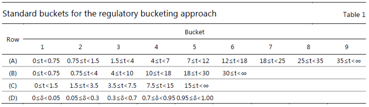

\newpage

# MAR31 Internal models approach: model requirements

*This chapter sets out specification and model eligibility for risk factors per the internal models approach.*

## Specification of market risk factors

An important part of a bank's trading desk internal risk management model is the specification of an appropriate set of
market risk factors. Risk factors are the market rates and prices that affect the value of the bank's trading positions.
The risk factors contained in a trading desk risk management model must be sufficient to represent the risks inherent in
the bank's portfolio of on- and off-balance sheet trading positions. Although banks will have some discretion in
specifying the risk factors for their internal models, the following requirements must be fulfilled.

A bank's market risk capital requirement models should include all risk factors that are used for pricing. In the event
a risk factor is incorporated in a pricing model but not in the trading desk risk management model, the bank must
support this omission to the satisfaction of its supervisory authority

A bank's market risk capital requirement model must include all risk factors that are specified in the standardised
approach for the corresponding risk class, as set out in [MAR20] to [MAR22]. In the event a standardised approach risk
factor is not included in the market risk capital requirement model, the bank must support this omission to the
satisfaction of its supervisory authority.

1. For securitised products, banks are prohibited from using internal models to determine market risk capital
   requirements. Banks must use the standardised approach to determine the market risk capital requirements for
   securitised products as set out in [MAR11.9]. Accordingly, a bank's market risk capital requirement model should not
   specify risk factors for securitisations as defined in [MAR21.10] to [MAR21.11]

A bank's market risk capital requirement model and any stress scenarios calculated for non-modellable risk factors must
address non-linearities for options and other relevant products (eg mortgage-backed securities), as well as correlation
risk and relevant basis risks (eg basis risks between credit default swaps and bonds).

A bank may use proxies for which there is an appropriate track record for their representation of a position (eg an
equity index used as a proxy for a position in an individual stock). In the event a bank uses proxies, the bank must
support their use to the satisfaction of the bank's supervisory authority.

For general interest rate risk, a bank must use a set of risk factors that corresponds to the interest rates associated
with each currency in which the bank has interest rate sensitive on- or off-balance sheet trading positions.

1. The trading desk risk management model must model the yield curve using one of a number of generally accepted
   approaches (eg estimating forward rates of zero coupon yields).

2. The yield curve must be divided into maturity segments in order to capture variation in the volatility of rates along
   the yield curve.

3. For material exposures to interest rate movements in the major currencies and markets, banks must model the yield
   curve using a minimum of six risk factors.

4. The number of risk factors used ultimately should be driven by the nature of the bank's trading strategies. A bank
   with a portfolio of various types of securities across many points of the yield curve and that engages in complex
   arbitrage strategies would require the use of a greater number of risk factors than a bank with less complex
   portfolios.

The trading desk risk management model must incorporate separate risk factors to capture credit spread risk (eg between
bonds and swaps). A variety of approaches may be used to reflect the credit spread risk arising from less-than-perfectly
correlated movements between government and other fixed income instruments, such as specifying a completely separate
yield curve for non-government fixed income instruments (eg swaps or municipal securities) or estimating the spread over
government rates at various points along the yield curve.

For exchange rate risk, the trading desk risk management model must incorporate risk factors that correspond to the
individual foreign currencies in which the bank's positions are denominated. Because the output of a bank's risk
measurement system will be expressed in the bank's reporting currency, any net position denominated in a foreign
currency will introduce foreign exchange risk. A bank must utilise risk factors that correspond to the exchange rate
between the bank's reporting currency and each foreign currency in which the bank has a significant exposure.

For equity risk, a bank must utilise risk factors that correspond to each of the equity markets in which the bank holds
significant positions.

1. At a minimum, a bank must utilise risk factors that reflect market-wide movements in equity prices (eg a market
   index). Positions in individual securities or in sector indices may be expressed in beta-equivalents relative to a
   market-wide index.

2. A bank may utilise risk factors that correspond to various sectors of the overall equity market (eg industry sectors
   or cyclical and non-cyclical sectors). Positions in individual securities within each sector may be expressed in
   beta-equivalents relative to a sector index.

3. A bank may also utilise risk factors that correspond to the volatility of individual equities.

4. The sophistication and nature of the modelling technique for a given market should correspond to the bank's exposure
   to the overall market as well as the bank's concentration in individual equities in that market.

For commodity risk, bank must utilise risk factors that correspond to each of the commodity markets in which the bank
holds significant positions

1. For banks with relatively limited positions in commodity-based instruments, the bank may utilise a straightforward
   specification of risk factors. Such a specification could entail utilising one risk factor for each commodity price
   to which the bank is exposed (including different risk factors for different geographies where relevant).

2. For a bank with active trading in commodities, the bank's model must account for variation in the convenience
   yield^[The convenience yield reflects the benefits from direct ownership of the physical commodity (eg the ability to profit from temporary market shortages). The convenience yield is affected both by market conditions and by factors such as physical storage costs.]
   between derivatives positions such as forwards and swaps and cash positions in the commodity.

For the risks associated with equity investments in funds:

1. For funds that meet the criterion set out in [RBC25.8](5)(a) (ie funds with look-through possibility), banks must
   consider the risks of the fund, and of any associated hedges, as if the fund's positions were held directly by the
   bank (taking into account the bank's share of the equity of the fund, and any leverage in the fund structure). The
   bank must assign these positions to the trading desk to which the fund is assigned.

2. For funds that do not meet the criterion set out in [RBC25.8](5)(a), but meet both the criteria set out
   in [RBC25.8](5)(b) (ie daily prices and knowledge of the mandate of the fund), banks must use the standardised
   approach to calculate capital requirements for the fund.

## Model eligibility of risk factors

A bank must determine which risk factors within its trading desks that have received approval to use the internal models
approach as set out in [MAR32] are eligible to be included in the bank's internal expected shortfall (ES) model for
regulatory capital requirements as set out in [MAR33]. For a risk factor to be classified as modellable by a bank, a
necessary condition is that it passes the risk factor eligibility test (RFET). This test requires identification of a
sufficient number of real prices that are representative of the risk factor. Collateral reconciliations or valuations
cannot be considered real prices to meet the RFET. A price will be considered real if it meets at least one of the
following criteria:

1. It is a price at which the institution has conducted a transaction;

2. It is a verifiable price for an actual transaction between other arms-length parties;

3. It is a price obtained from a committed quote made by (i) the bank itself or (ii) another party. The committed quote
   must be collected and verified through a third-party vendor, a trading platform or an exchange; or

4. It is a price that is obtained from a third-party vendor, where:

    * the transaction or committed quote has been processed through the vendor;
    * the vendor agrees to provide evidence of the transaction or committed quote to supervisors upon request; or
    * the price meets any of the three criteria immediately listed in [MAR31.12](1) to [MAR31.12](3).

To pass the RFET, a risk factor that a bank uses in an internal model must meet either of the following criteria on a
quarterly basis. Any real price that is observed for a transaction should be counted as an observation for all of the
risk factors for which it is representative.

1. The bank must identify for the risk factor at least 24 real price observations per year (measured over the period
   used to calibrate the current ES model, with no more than one real price observation per day to be included in this
   count)
   .^[When a bank uses data for real price observations from an external source, and those observations are provided with a time lag (eg data provided for a particular day is only made available a number of weeks later), the period used for the RFET may differ from the period used to calibrate the current ES model. The difference in periods used for the RFET and calibration of the ES model should not be greater than one month, ie the banks could use, for each risk factor, a one-year time period finishing up to one month before the RFET assessment instead of the period used to calibrate the current ES model.]
   ^[In particular, a bank may add modellable risk factors, and replace non-modellable risk factors by a basis between these additional modellable risk factors and these non-modellable risk factors. This basis will then be considered a non-modellable risk factor. A combination between modellable and non-modellable risk factors will be a non-modellable risk factor.]
   Moreover, over the previous 12 months there must be no 90-day period in which fewer than four real price observations
   are identified for the risk factor (with no more than one real price observation per day to be included in this
   count). The above criteria must be monitored on a monthly basis; or

2. The bank must identify for the risk factor at least 100 "real" price observations over the previous 12 months (with
   no more than one "real" price observation per day to be included in this count).

In order for a risk factor to pass the RFET, a bank may also count real price observations based on information
collected from a third-party vendor provided all of the following criteria are met:

1. The vendor communicates to the bank the number of corresponding real prices observed and the dates at which they have
   been observed.

2. The vendor provides, individually, a minimum necessary set of identifier information to enable banks to map real
   prices observed to risk factors.

3. The vendor is subject to an audit regarding the validity of its pricing information. The results and reports of this
   audit must be made available on request to the relevant supervisory authority and to banks as a precondition for the
   bank to be allowed to use real price observations collected by the third-party vendor. If the audit of a third-party
   vendor is not satisfactory to a supervisory authority, the supervisory authority may decide to prevent the bank from
   using data from this
   vendor.^[In this case, the bank may be permitted to use real price observations from this vendor for other risk factors.]

A real price is representative for a risk factor of a bank where the bank is able to extract the value of the risk
factor from the value of the real price. The bank must have policies and procedures that describe its mapping of real
price observations to risk factors. The bank must provide sufficient information to its supervisory authorities in order
to determine if the methodologies the bank uses are appropriate.

## Bucketing approach for the RFET

Where a risk factor is a point on a curve or a surface (and other higher dimensional objects such as cubes), in order to
count real price observations for the RFET, banks may choose from the following bucketing approaches:

1. The own bucketing approach. Under this approach, the bank must define the buckets it will use and meet the following
   requirements:

    * Each bucket must include only one risk factor, and all risk factors must correspond to the risk factors that are
      part of the risk-theoretical profit and loss (RTPL) of the bank for the purpose of the profit and loss (P&L)
      attribution (PLA)
      test.^[The requirement to use the same buckets or segmentation of risk factors for the PLA test and the RFET recognises that there is a trade-off in determining buckets for an ES model. The use of more granular buckets may facilitate a trading desk's success in meeting the requirements of the PLA test, but additional granularity may challenge a bank's ability to source a sufficient number of real observed prices per bucket to satisfy the RFET. Banks should consider this trade-off when designing their ES models.]

    * The buckets must be non-overlapping.

2. The regulatory bucketing approach. Under this approach, the bank must use the following set of standard buckets as
   set out in Table 1.

    * For interest rate, foreign exchange and commodity risk factors with one maturity dimension (excluding implied
      volatilities) (t, where t is measured in years), the buckets in row (A) below must be used.

    * For interest rate, foreign exchange and commodity risk factors with several maturity dimensions (excluding implied
      volatilities) (t, where t is measured in years), the buckets in row (B) below must be used.

    * Credit spread and equity risk factors with one or several maturity dimensions (excluding implied volatilities) (t,
      where t is measured in years), the buckets in row (C) below must be used.

    * For any risk factors with one or several strike dimensions (delta, $\delta$; ie the probability that an option
      is "in the money" at maturity), the buckets in row (D) below must be
      used.^[For options markets where alternative definitions of moneyness are standard, banks shall convert the regulatory delta buckets to the market-standard convention using their own approved pricing models.]

    * For expiry and strike dimensions of implied volatility risk factors (excluding those of interest rate swaptions),
      only the buckets in rows (C) and (D) below must be used.

    * For maturity, expiry and strike dimensions of implied volatility risk factors from interest rate swaptions, only
      the buckets in row (B), (C) and (D) below must be used.

*Table 1*

Banks may count all real price observations allocated to a bucket to assess whether it passes the RFET for any risk
factors that belong to the bucket. A real price observation must be allocated to a bucket for which it is representative
of any risk factors that belong to the bucket.

As debt instruments mature, real price observations for those products that have been identified within the prior 12
months are usually still counted in the maturity bucket to which they were initially allocated per [MAR31.17]. When
banks no longer need to model a credit spread risk factor belonging to a given maturity bucket, banks are allowed to
re-allocate the real price observations of this bucket to the adjacent (shorter) maturity
bucket.^[For example, if a bond with an original maturity of four years, had a real price observation on its issuance date eight months ago, banks can opt to allocate the real price observation to the bucket associated with a maturity between 1.5 and 3.5 years instead of to the bucket associated with a maturity between 3.5 and 7.5 years to which it would normally be allocated.]
A real price observation may only be counted in a single maturity bucket for the purposes of the RFET.

Where a bank uses a parametric function to represent a curve/surface and defines the function's parameters as the risk
factors in its risk measurement system, the RFET must be passed at the level of the market data used to calibrate the
function's parameters and not be passed directly at the level of these risk factor parameters (due to the fact that real
price observations may not exist that are directly representative of these risk factors).

A bank may use systematic credit or equity risk factors within its models that are designed to capture market-wide
movements for a given economy, region or sector, but not the idiosyncratic risk of a specific issuer (the idiosyncratic
risk of a specific issuer would be a non-modellable risk factor (NMRF) unless there are sufficient real price
observations of that issuer). Real price observations of market indices or instruments of individual issuers may be
considered representative for a systematic risk factor as long as they share the same attributes as the systematic risk
factor.

In addition to the approach set out in [MAR31.20], where systematic risk factors of credit or equity risk factors
include a maturity dimension (eg a credit spread curve), one of the bucketing approaches set out above must be used for
this maturity dimension to count “real” price observations for the RFET.

Once a risk factor has passed the RFET, the bank should choose the most appropriate data to calibrate its model. The
data used for calibration of the model does not need to be the same data used to pass the RFET.

Once a risk factor has passed the RFET, the bank must demonstrate that the data used to calibrate its ES model are
appropriate based on the principles contained in [MAR31.25] to [MAR31.26]. Where a bank has not met these principles to
the satisfaction of its supervisory authority for a particular risk factor, the supervisory authority may choose to deem
the data unsuitable for use to calibrate the model and, in such case, the risk factor must be excluded from the ES model
and subject to capital requirements as an NMRF.

There may, on very rare occasions, be a valid reason why a significant number of modellable risk factors across
different banks may become non-modellable due to a widespread reduction in trading activities (for instance, during
periods of significant cross-border financial market stress affecting several banks or when financial markets are
subjected to a major regime shift). One possible supervisory response in this instance could be to consider as
modellable a risk factor that no longer passes the RFET. However, such a response should not facilitate a decrease in
capital requirements. Supervisory authorities should only pursue such a response under the most extraordinary, systemic
circumstances.

Banks use many different types of models to determine the risks resulting from trading positions. The data requirements
for each model may be different. For any given model, banks may use different sources or types of data for the model's
risk factors. Banks must not rely solely on the number of observations of real prices to determine whether a risk factor
is modellable. The accuracy of the source of the risk factor real price observation must also be considered.

In addition to the requirements specified in [MAR31.12] to [MAR31.23], banks must apply the principles below to
determine whether a risk factor that passed the RFET can be modelled using the ES model or should be subject to capital
requirements as an NMRF. Banks are required to demonstrate to their supervisory authorities that these principles are
being followed. Supervisory authorities may determine risk factors to be non-modellable in the event these principles
are not applied.

1. Principle one. The data used may include combinations of modellable risk factors. Banks often price instruments as a
   combination of risk factors. Generally, risk factors derived solely from a combination of modellable risk factors are
   modellable. For example, risk factors derived through multifactor beta models for which inputs and calibrations are
   based solely on modellable risk factors, can be classified as modellable and can be included within the ES model. A
   risk factor derived from a combination of modellable risk factors that are mapped to distinct buckets of a given
   curve/surface is modellable only if this risk factor also passes the RFET.

    * Interpolation based on combinations of modellable risk factors should be consistent with mappings used for PLA
      testing (to determine the RTPL) and should not be based on alternative, and potentially broader, bucketing
      approaches. Likewise, banks may compress risk factors into a smaller dimension of orthogonal risk factors (eg
      principal components) and/or derive parameters from observations of modellable risk factors, such as in models of
      stochastic implied volatility, without the parameters being directly observable in the market.

    * Subject to the approval of the supervisor, banks may extrapolate up to a reasonable distance from the closest
      modellable risk factor. The extrapolation should not rely solely on the closest modellable risk factor but on more
      than one modellable risk factor. In the event that a bank uses extrapolation, the extrapolation must be considered
      in the determination of the RTPL.

2. Principle two. The data used must allow the model to pick up both idiosyncratic and general market risk. General
   market risk is the tendency of an instrument's value to change with the change in the value of the broader market, as
   represented by an appropriate index or indices. Idiosyncratic risk is the risk associated with a particular issuance,
   including default provisions, maturity and seniority. The data must allow both components of market risk to be
   captured in any market risk model used to determine capital requirements. If the data used in the model do not
   reflect either idiosyncratic or general market risk, the bank must apply an NMRF charge for those aspects that are
   not adequately captured in its model.

3. Principle three. The data used must allow the model to reflect volatility and correlation of the risk positions.
   Banks must ensure that they do not understate the volatility of an asset (eg by using inappropriate averaging of data
   or proxies). Further, banks must ensure that they accurately reflect the correlation of asset prices, rates across
   yield curves and/or volatilities within volatility surfaces. Different data sources can provide dramatically
   different volatility and correlation estimates for asset prices. The bank should choose data sources so as to ensure
   that (i) the data are representative of real price observations; (ii) price volatility is not understated by the
   choice of data; and (iii) correlations are reasonable approximations of correlations among real price observations.
   Furthermore, any transformations must not understate the volatility arising from risk factors and must accurately
   reflect the correlations arising from risk factors used in the bank's ES model.

4. Principle four. The data used must be reflective of prices observed and/or quoted in the market. Where data used are
   not derived from real price observations, the bank must demonstrate that the data used are reasonably representative
   of real price observations. To that end, the bank must periodically reconcile price data used in a risk model with
   front office and back office prices. Just as the back office serves to check the validity of the front office price,
   risk model prices should be included in the comparison. The comparison of front or back office prices with risk
   prices should consist of comparisons of risk prices with real price observations, but front office and back office
   prices can be used where real price observations are not widely available. Banks must document their approaches to
   deriving risk factors from market prices.

5. Principle five. The data used must be updated at a sufficient frequency. A market risk model may require large
   amounts of data, and it can be challenging to update such large data sets frequently. Banks should strive to update
   their model data as often as possible to account for frequent turnover of positions in the trading portfolio and
   changing market conditions. Banks should update data at a minimum on a monthly basis, but preferably daily.
   Additionally, banks should have a workflow process for updating the sources of data. Furthermore, where the bank uses
   regressions to estimate risk factor parameters, these must be re-estimated on a regular basis, generally no less
   frequently than every two weeks. Calibration of pricing models to current market prices must also be sufficiently
   frequent, ideally no less frequent than the calibration of front office pricing models. Where appropriate, banks
   should have clear policies for backfilling and/or gap-filling missing data.

6. Principle six. The data used to determine stressed expected shortfall ($ES_{R,S}$) must be reflective of market
   prices observed and/or quoted in the period of stress. The data for the $ES_{R,S}$ model should be sourced directly
   from the historical period whenever possible. There are cases where the characteristics of current instruments in the
   market differ from those in the stress period. Nevertheless, banks must empirically justify any instances where the
   market prices used for the stress period are different from the market prices actually observed during that period.
   Further, in cases where instruments that are currently traded did not exist during a period of significant financial
   stress, banks must demonstrate that the prices used match changes in prices or spreads of similar instruments during
   the stress period.

    * (a) In cases where banks do not sufficiently justify the use of current market data for products whose
      characteristics have changed since the stress period, the bank must omit the risk factor for the stressed period
      and meet the requirement of [MAR33.5](2)(b) that the reduced set of risk factors explain 75\% of the fully
      specified ES model. Moreover, if name-specific risk factors are used to calculate the ES in the actual period and
      these names were not available in the stressed period, there is a presumption that the idiosyncratic part of these
      risk factors are not in the reduced set of risk factors. Exposures for risk factors that are included in the
      current set but not in the reduced set need to be mapped to the most suitable risk factor of the reduced set for
      the purposes of calculating ES measures in the stressed period.

7. Principle seven. The use of proxies must be limited, and proxies must have sufficiently similar characteristics to
   the transactions they represent. Proxies must be appropriate for the region, quality and type of instrument they are
   intended to represent. Supervisors will assess whether methods for combining risk factors are conceptually and
   empirically sound.

    * For example, the use of indices in a multifactor model must capture the correlated risk of the assets represented
      by the indices, and the remaining idiosyncratic risk must be demonstrably uncorrelated across different issuers. A
      multifactor model must have significant explanatory power for the price movements of assets and must provide an
      assessment of the uncertainty in the final outcome due to the use of a proxy. The coefficients (betas) of a
      multifactor model must be empirically based and must not be determined based on judgment. Instances where
      coefficients are set by judgment generally should be considered as NMRFs.

    * If risk factors are represented by proxy data in the current period ES model, the proxy data representation of the
      risk factor – not the risk factor itself – must be used in the RTPL unless the bank has identified the basis
      between the proxy and the actual risk factor and properly capitalised the basis either by including the basis in
      the ES model (if the risk factor is a modellable) or capturing the basis as a NMRF. If the capital requirement for
      the basis is properly determined, then the bank can choose to include in the RTPL either:

        * the proxy risk factor and the basis; or
        * the actual risk factor itself.

