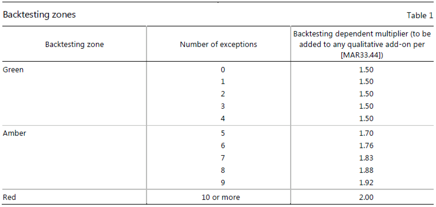
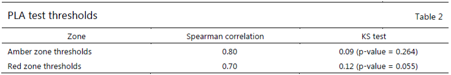

# MAR32 Internal models approach: backtesting and P&L attribution test requirements

*This chapter sets out the profit and loss attribution test and backtesting requirements for banks that use the internal
models approach.*

As set out in [MAR30.4], a bank that intends to use the internal models approach (IMA) to determine market risk capital
requirements for a trading desk must conduct and successfully pass backtesting at the bank-wide level and both the
backtesting and profit and loss (P&L) attribution (PLA) test at the trading desk level as identified in [MAR30.4](2).

For a bank to remain eligible to use the IMA to determine market risk capital requirements, a minimum of 10\% of the
bank's aggregated market risk capital requirement must be based on positions held in trading desks that qualify for use
of the bank's internal models for market risk capital requirements by satisfying the backtesting and PLA test as set out
in this chapter. This 10% criterion must be assessed by the bank on a quarterly basis when calculating the aggregate
capital requirement for market risk according to [MAR33.43].

The implementation of the backtesting programme and the PLA test must begin on the date that the internal models capital
requirement becomes effective.

1. For supervisory approval of a model, the bank must provide a one-year backtesting and PLA test report to confirm the
   quality of the model.

2. The bank's supervisory authority may require backtesting and PLA test results prior to that date.

3. The bank's supervisory authority will determine any necessary supervisory response to backtesting results based on
   the number of exceptions over the course of 12 months (ie 250 trading days) generated by the bank's model.

    * Based on the assessment on the significance of exceptions, the supervisory authority may initiate a dialogue with
      the bank to determine if there is a problem with a bank's model.

    * In the most serious cases, the supervisory authority will impose an additional increase in a bank's capital
      requirement or disallow use of the model.

## Backtesting requirements

Backtesting requirements compare the value-at-risk (VaR) measure calibrated to a one-day holding period against each of
the actual P&L (APL) and hypothetical P&L (HPL) over the prior 12 months. Specific requirements to be applied at the
bank-wide level and trading desk level are set out below.

Backtesting of the bank-wide risk model must be based on a VaR measure calibrated at a 99th percentile confidence level.

1. An exception or an outlier occurs when either the actual loss or the hypothetical loss of the bank-wide trading book
   registered in a day of the backtesting period exceeds the corresponding daily VaR measure given by the model. As
   per [MAR99.8], exceptions for actual losses are counted separately from exceptions for hypothetical losses; the
   overall number of exceptions is the greater of these two amounts.

2. In the event either the P&L or the daily VaR measure is not available or impossible to compute, it will count as an
   outlier.

In the event an outlier can be shown by the bank to relate to a non-modellable risk factor, and the capital requirement
for that non-modellable risk factor exceeds the actual or hypothetical loss for that day, it may be disregarded for the
purpose of the overall backtesting process if the supervisory authority is notified accordingly and does not object to
this treatment. In these cases, a bank must document the history of the movement of the value of the relevant
non-modellable risk factor and have supporting evidence that the non-modellable risk factor has caused the relevant
loss.

The scope of the portfolio subject to bank-wide backtesting should be updated quarterly based on the results of the
latest trading desk-level backtesting, risk factor eligibility test and PLA tests.

The framework for the supervisory interpretation of backtesting results for the bank-wide capital model encompasses a
range of possible responses, depending on the strength of the signal generated from the backtesting. These responses are
classified into three backtesting zones, distinguished by colours into a hierarchy of responses.

1. Green zone. This corresponds to results that do not themselves suggest a problem with the quality or accuracy of a
   bank's model.

2. Amber zone. This encompasses results that do raise questions in this regard, for which such a conclusion is not
   definitive.

3. Red zone. This indicates a result that almost certainly indicates a problem with a bank's risk model.

These zones are defined according to the number of exceptions generated in the backtesting programme considering
statistical errors as explained in [MAR99.9] to [MAR99.21]. Table 1 sets out boundaries for these zones and the
presumptive supervisory response for each backtesting outcome, based on a sample of 250 observations.

*Table 1*

The backtesting green zone generally would not initiate a supervisory increase in capital requirements for backtesting (
ie no backtesting add-on would apply).

Outcomes in the backtesting amber zone could result from either accurate or inaccurate models. However, they are
generally deemed more likely for inaccurate models than for accurate models. Within the backtesting amber zone, the
supervisory authority will impose a higher capital requirement in the form of a backtesting add-on. The number of
exceptions should generally inform the size of any backtesting add-on, as set out in Table 1 of [MAR32.9].

A bank must also document all of the exceptions generated from its ongoing backtesting programme, including an
explanation for each exception.

A bank may also implement backtesting for confidence intervals other than the 99th percentile, or may perform other
statistical tests not set out in this standard.

Besides a higher capital requirement for any outcomes that place the bank in the backtesting amber zone, in the case of
severe problems with the basic integrity of the model, the supervisory authority may consider whether to disallow the
bank's use of the model for market risk capital requirement purposes altogether.

If a bank's model falls into the backtesting red zone, the supervisor will automatically increase the multiplication
factor applicable to the bank's model or may disallow use of the model.

### Backtesting at the trading desk level

The performance of a trading desk's risk management model will be tested through daily backtesting.

The backtesting assessment is considered to be complementary to the PLA assessment when determining the eligibility of a
trading desk for the IMA.

At the trading desk level, backtesting must compare each desk's one-day VaR measure (calibrated to the most recent 12
months' data, equally weighted) at both the 97.5th percentile and the 99th percentile, using at least one year of
current observations of the desk's one-day P&L.

1. An exception or an outlier occurs when either the actual or hypothetical loss of the trading desk registered in a day
   of the backtesting period exceeds the corresponding daily VaR measure determined by the bank's model. Exceptions for
   actual losses are counted separately from exceptions for hypothetical losses; the overall number of exceptions is the
   greater of these two amounts.

2. In the event either the P&L or the risk measure is not available or impossible to compute, it will count as an
   outlier.

If any given trading desk experiences either more than 12 exceptions at the 99th percentile or 30 exceptions at the
97.5th percentile in the most recent 12-month period, the capital requirement for all of the positions in the trading
desk must be determined using the standardised
approach.^[Desks with exposure to issuer default risk must pass a two-stage approval process. First, the market risk model must pass backtesting and PLA. Conditional on approval of the market risk model, the desk may then apply for approval to model default risk. Desks that fail either test must be capitalised under the standardised approach.]

## PLA test requirements

The PLA test compares daily risk-theoretical P&L (RTPL) with the daily HPL for each trading desk. It intends to:

1. measure the materiality of simplifications in a banks' internal models used for determining market risk capital
   requirements driven by missing risk factors and differences in the way positions are valued compared with their front
   office systems; and

2. prevent banks from using their internal models for the purposes of capital requirements when such simplifications are
   considered material.

The PLA test must be performed on a standalone basis for each trading desk in scope for use of the IMA.

### Definition of profits and losses used for the PLA test and backtesting

The RTPL is the daily trading desk-level P&L that is produced by the valuation engine of the trading desk's risk
management model.

1. The trading desk's risk management model must include all risk factors that are included in the bank's expected
   shortfall (ES) model with supervisory parameters and any risk factors deemed not modellable by the supervisory
   authority, and which are therefore not included in the ES model for calculating the respective regulatory capital
   requirement, but are included in non-modellable risk factors.

2. The RTPL must not take into account any risk factors that the bank does not include in its trading desk's risk
   management model.

Movements in all risk factors contained in the trading desk's risk management model should be included, even if the
forecasting component of the internal model uses data that incorporates additional residual risk. For example, a bank
using a multifactor beta-based index model to capture event risk might include alternative data in the calibration of
the residual component to reflect potential events not observed in the name-specific historical time series. The fact
that the name is a risk factor in the model, albeit modelled in a multifactor model environment, means that, for the
purposes of the PLA test, the bank would include the actual return of the name in the RTPL (and in the HPL) and receive
recognition for the risk factor coverage of the model.

The PLA test compares a trading desk's RTPL with its HPL. The HPL used for the PLA test should be identical to the HPL
used for backtesting purposes. This comparison is performed to determine whether the risk factors included and the
valuation engines used in the trading desk's risk management model capture the material drivers of the bank's P&L by
determining if there is a significant degree of association between the two P&L measures observed over a suitable time
period. The RTPL can differ from the HPL for a number of reasons. However, a trading desk risk management model should
provide a reasonably accurate assessment of the risks of a trading desk to be deemed eligible for the internal
models-based approach.

The HPL must be calculated by revaluing the positions held at the end of the previous day using the market data of the
present day (ie using static positions). As HPL measures changes in portfolio value that would occur when end-of-day
positions remain unchanged, it must not take into account intraday trading nor new or modified deals, in contrast to the
APL. Both APL and HPL include foreign denominated positions and commodities included in the banking book.

Fees and commissions must be excluded from both APL and HPL as well as valuation adjustments for which separate
regulatory capital approaches have been otherwise specified as part of the rules (eg credit valuation adjustment and its
associated eligible hedges) and valuation adjustments that are deducted from Common Equity Tier 1 (eg the impact on the
debt valuation adjustment component of the fair value of financial instruments must be excluded from these P&Ls).

Any other market risk-related valuation adjustments, irrespective of the frequency by which they are updated, must be
included in the APL while only valuation adjustments updated daily must be included in the HPL, unless the bank has
received specific agreement to exclude them from its supervisory authority. Smoothing of valuation adjustments that are
not calculated daily is not allowed. P&L due to the passage of time should be included in the APL and should be treated
consistently in both HPL and
RTPL.^[Time effects can include various elements such as: the sensitivity to time, or theta effect (ie using mathematical terminology, the first-order derivative of the price relative to the time) and carry or costs of funding.]

Valuation adjustments that the bank is unable to calculate at the trading desk level (eg because they are assessed in
terms of the bank's overall positions/risks or because of other constraints around the assessment process) are not
required to be included in the HPL and APL for backtesting at the trading desk level, but should be included for
bank-wide backtesting. To the satisfaction of its supervisory authority, the bank must provide support for valuation
adjustments that are not computed at a trading desk level.

Both APL and HPL must be computed based on the same pricing models (eg same pricing functions, pricing configurations,
model parametrisation, market data and systems) as the ones used to produce the reported daily P&L.

### PLA test data input alignment

For the sole purpose of the PLA assessment, banks are allowed to align RTPL input data for its risk factors with the
data used in HPL if these alignments are documented, justified to the supervisory authority and the requirements set out
below are fulfilled:

1. Banks must demonstrate that HPL input data can be appropriately used for RTPL purposes, and that no risk factor
   differences or valuation engine differences are omitted when transforming HPL input data into a format which can be
   applied to the risk factors used in RTPL calculation.

2. Any adjustment of RTPL input data must be properly documented, validated and justified to the supervisory authority.

3. Banks must have procedures in place to identify changes with regard to the adjustments of RTPL input data. Banks must
   notify the supervisory authority of any such changes.

4. Banks must provide assessments on the effect these input data alignments would have on the RTPL and the PLA test. To
   do so, banks must compare RTPL based on HPL-aligned market data with the RTPL based on market data without alignment.
   This comparison must be performed when designing or changing the input data alignment process and upon the request of
   the bank's supervisory authority.

Adjustments to RTPL input data will be allowed when the input data for a given risk factor that is included in both the
RTPL and the HPL differs due to different providers of market data sources or time fixing of market data sources, or
transformations of market data into input data suitable for the risk factors of the underlying pricing models. These
adjustments can be done either:

1. by direct replacement of the RTPL input data (eg par rate tenor x, provider a) with the HPL input data (eg par rate
   tenor x, provider b); or

2. by using the HPL input data (eg par rate tenor x, provider b) as a basis to calculate the risk factor data needed in
   the RTPL/ES model (eg zero rate tenor x).

If the HPL uses market data in a different manner to RTPL to calculate risk parameters that are essential to the
valuation engine, these differences must be reflected in the PLA test and as a result in the calculation of HPL and
RTPL. In this regard, HPL and RTPL are allowed to use the same market data only as a basis, but must use their
respective methods (which can differ) to calculate the respective valuation engine parameters. This would be the case,
for example, where market data are transformed as part of the valuation process used to calculate RTPL. In that
instance, banks may align market data between RTPL and HPL pre-transformation but not post-transformation.

Banks are not permitted to align HPL input data for risk factors with input data used in RTPL. Adjustments to RTPL or
HPL to address residual operational noise are not permitted. Residual operational noise arises from computing HPL and
RTPL in two different systems at two different points in time. It may originate from transitioning large portions of
data across systems, and potential data aggregations may result in minor reconciliation gaps below tolerance levels for
intervention; or from small differences in static/reference data and configuration.

### PLA test metrics

The PLA requirements are based on two test metrics:

1. the Spearman correlation metric to assess the correlation between RTPL and HPL; and

2. the Kolmogorov-Smirnov (KS) test metric to assess similarity of the distributions of RTPL and HPL.

To calculate each test metric for a trading desk, the bank must use the time series of the most recent 250 trading days
of observations of RTPL and HPL.

### Process for determining the Spearman correlation metric

For a time series of HPL, banks must produce a corresponding time series of ranks based on the size of the P&L
($R_\text{HPL}$). That is, the lowest value in the HPL time series receives a rank of 1, the next lowest value receives
a rank of 2 and so on.

Similarly, for a time series of RTPL, banks must produce a corresponding time series of ranks based on size
($R_\text{RTPL}$).

Banks must calculate the Spearman correlation coefficient of the two time series of rank values of $R_\text{RTPL}$ and
$R_\text{HPL}$ based on size using the following formula, where $\sigma_\text{HPL}$ and $\sigma_\text{RTPL}$ are the
standard deviations of $R_\text{RTPL}$ and $R_\text{HPL}$.

$$ r_s = \frac{cov(R_\text{HPL}, R_\text{RTPL})}{\sigma_\text{HPL} \times \sigma_\text{RTPL}} $$

### Process for determining Kolmogorov-Smirnov test metrics

The bank must calculate the empirical cumulative distribution function of RTPL. For any value of RTPL, the empirical
cumulative distribution is the product of 0.004 and the number of RTPL observations that are less than or equal to the
specified RTPL.

The bank must calculate the empirical cumulative distribution function of HPL. For any value of HPL, the empirical
cumulative distribution is the product of 0.004 and number of HPL observations that are less than or equal to the
specified HPL.

The KS test metric is the largest absolute difference observed between these two empirical cumulative distribution
functions at any P&L value.

### PLA test metrics evaluation

Based on the outcome of the metrics, a trading desk is allocated to a PLA test red zone, an amber zone or a green zone
as set out in Table 2.

1. A trading desk is in the PLA test green zone if both

    * the correlation metric is above 0.80; and
    * the KS distributional test metric is below 0.09 (p-value = 0.264).

2. A trading desk is in the PLA test red zone if the correlation metric is less than 0.7 or if the KS distributional
   test metric is above 0.12 (p-value = 0.055).

3. A trading desk is in the PLA amber zone if it is allocated neither to the green zone nor to the red zone.

*Table 2*

If a trading desk is in the PLA test red zone, it is ineligible to use the IMA to determine market risk capital
requirements and must be use the standardised approach.

1. Risk exposures held by these ineligible trading desks must be included with the out-of-scope trading desks for
   purposes of determining capital requirement per the standardised approach.

2. A trading desk deemed ineligible to use the IMA must remain out-of-scope to use the IMA until:

    * the trading desk produces outcomes in the PLA test green zone; and
    * the trading desk has satisfied the backtesting exceptions requirements over the past 12 months.

If a trading desk is in the PLA test amber zone, it is not considered an out-of-scope trading desk for use of the IMA.

1. If a trading desk is in the PLA test amber zone, it cannot return to the PLA test green zone until:

    * the trading desk produces outcomes in the PLA test green zone; and
    * the trading desk has satisfied its backtesting exceptions requirements over the prior 12 months.

2. Trading desks in the PLA test amber zone are subject to a capital surcharge as specified in [MAR33.43]

## Treatment for exceptional situations

There may, on very rare occasions, be a valid reason why a series of accurate trading desk level-models across different
banks will produce many backtesting exceptions or inadequately track the P&L produced by the front office pricing
model (for instance, during periods of significant cross-border financial market stress affecting several banks or when
financial markets are subjected to a major regime shift). One possible supervisory response in this instance would be to
permit the relevant trading desks to continue to use the IMA but require each trading desk's model to take account of
the regime shift or significant market stress as quickly as practicable while maintaining the integrity of its
procedures for updating the model. Supervisory authorities should only pursue such a response under the most
extraordinary, systemic circumstances.
