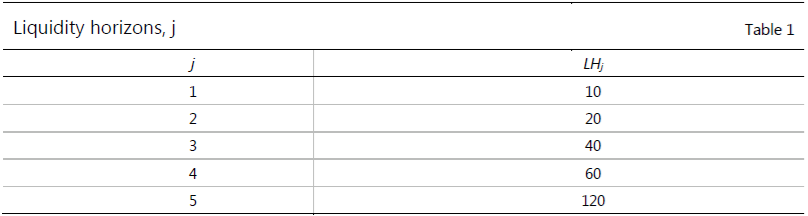

# MAR33 Internal models approach: capital requirements calculation

*This chapter sets out the process by which capital requirements are calculated per the internal models approach.*

## Calculation of expected shortfall

Banks will have flexibility in devising the precise nature of their expected shortfall (ES) models, but the following
minimum standards will apply for the purpose of calculating market risk capital requirements. Individual banks or their
supervisory authorities will have discretion to apply stricter standards.

ES must be computed on a daily basis for the bank-wide internal models to determine market risk capital requirements. ES
must also be computed on a daily basis for each trading desk that uses the internal models approach (IMA).

In calculating ES, a bank must use a 97.5th percentile, one-tailed confidence level.

In calculating ES, the liquidity horizons described in [MAR33.12] must be reflected by scaling an ES calculated on a
base horizon. The ES for a liquidity horizon must be calculated from an ES at a base liquidity horizon of 10 days with
scaling applied to this base horizon result as expressed below, where:

1. $\mathit{ES}$ is the regulatory liquidity-adjusted ES;

2. $T$ is the length of the base horizon, ie 10 days;

3. $\mathit{ES}_T(P)$ is the ES at horizon $T$ of a portfolio with positions $P = (p_i)$ with respect to shocks to all
   risk factors that the positions P are exposed to;

4. $\mathit{ES}_T(P, j)$ is the ES at horizon $T$ of a portfolio with positions $P = (p_i)$ with respect to shocks for
   each position $p_i$ in the subset of risk factors $Q(p_i, j)$, with all other risk factors held constant;

5. the $\mathit{ES}$ at horizon $T$, $\mathit{ES}_T(P)$ must be calculated for changes in the risk factors, and
   $\mathit{ES}_T(P, j)$ must be calculated for changes in the relevant subset $Q(p_i, j)$ of risk factors, over the
   time interval $T$ without scaling from a shorter horizon;

6. $Q(p_i, j)$ is the subset of risk factors for which liquidity horizons, as specified in [MAR33.12], for the desk
   where $p_i$ is booked are at least as long as $\mathit{LH}_j$ according to the table below. For example, $Q(p_i,4)$
   is the set of risk factors with a 60-day horizon and a 120-day liquidity horizon. Note that $Q(p_i , j)$ is a subset
   of $Q(p_i , j-1)$;

7. the time series of changes in risk factors over the base time interval $T$ may be determined by overlapping
   observations; and

8. $\mathit{LH}_j$ is the liquidity horizon $j$, with lengths in the following table:

*Table 1*

$$ ES = \sqrt{ \left( \mathit{ES}(P) \right)^2 + \sum_{j >= 2} { \left( \mathit{ES}_T(P,j) \sqrt{ \frac{(\mathit{LH}_j - \mathit{LH}_{j-1}}{T} } \right)^2 } } $$
